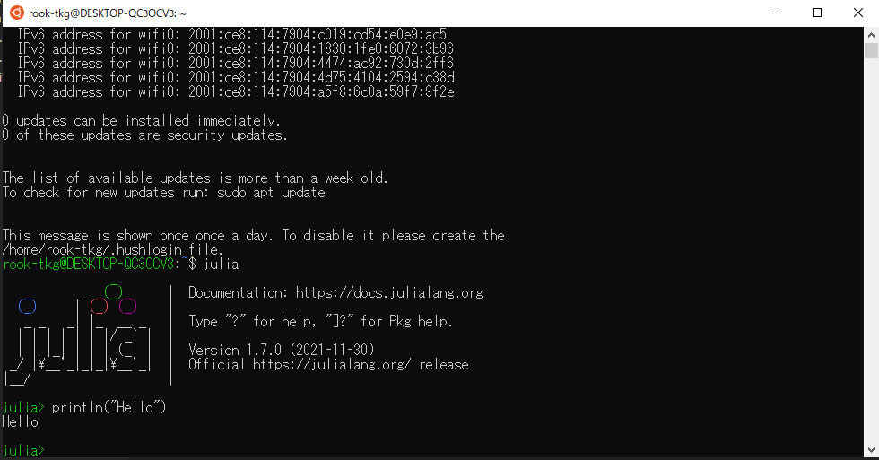

# **python,juliaをNotebookで書くための環境構築(Windows)**<!-- omit in toc -->
- [**1. 諸々のソフトをインストール**](#1-諸々のソフトをインストール)
- [**2. インストールしたソフトの設定**](#2-インストールしたソフトの設定)
  - [**2.1. julia(WSL内で動かす場合の準備)**](#21-juliawsl内で動かす場合の準備)
  - [**2.2. julia**](#22-julia)
  - [**2.3. VScode**](#23-vscode)

以下では、pythonとjuliaをJupyter Notebookで書き、実行するための手順を説明する。

最初に、Anaconda内のJupyter Notebookで作業する場合を説明し、その次にVScodeで作業する場合を説明する。

筆者の知識不足のため、不要あるいは重複した過程も含まれているかもしれないことを予め断っておく。また、VScodeの環境構築しか必要の無い方にとっては、Anacondaをインストールする必要は無い。
しかし、Anacondaをインストールしていないことによって、以下の過程の中でうまく動作しないものがあるかもしれない。この場合については巷のWebページなどを参考にしていただきたい。
# **1. 諸々のソフトをインストール**

今回扱うソフトは以下のURLからインストールできる。WSL内でjuliaを使う場合は、Linux用をインストールする必要がある。また、commandpromptやWindowsPoewrshell内で使う場合は、juliaのインストール時にPATHを通しておくと便利。

| ソフト名 | URL |
| ---- | ---- |
| julia | https://julialang.org/downloads/  
| Anaconda | https://www.anaconda.com/products/individual |
| VScode | https://code.visualstudio.com/download |

# **2. インストールしたソフトの設定**
## **2.1. julia(WSL内で動かす場合の準備)**
WSLで動かす場合は、ダウンロードしたファイルを移動するとよいらしい。
これについては、以下のWebページが参考になる;

http://kimamani-programing.info/2019/12/07/wsl%E3%81%ABjulia%E3%82%92%E3%82%A4%E3%83%B3%E3%82%B9%E3%83%88%E3%83%BC%E3%83%AB%E3%81%97%E3%81%A6%E3%81%BF%E3%81%9F%EF%BC%81%EF%BC%81/

ちなみに、筆者の環境では、このページ内の「tar ..」コマンドが「sudo」をつけないと実行できなかった。

## **2.2. julia**
juliaのPATHが通っていれば(WSLの場合は、上の手続きによってシンボリックリンクが作成できていれば)、コマンドラインで「julia」と入力すると以下の画面になるはずである。

起動したのはREPLと呼ばれる対話型実行環境で、この画面でjuliaのコードを入力すると実行してくれる。

試しに「println("Hello")」と入力してみよう。　

次に、" ] "と入力してみよう。これにより、入力待ちの行の色が変わり、パッケージモードと呼ばれるモードになる。パッケージモードでは、juliaの色んなパッケージを追加できる。例えば、グラフなどを書くための「Plots」というパッケージはデフォルトでは入っておらず、パッケージモードで追加する必要がある。

**今回必要なのは「IJulia」というパッケージなので、「add IJulia」と入力する。**

パッケージモードから元に戻るためには、「Ctrl + C」と入力する。この状態で、「using IJulia」と入力した後に「notebook()」と入力すると、AnacondaのJupyter Notebookが開かれるはずである。この状態で、既にjuliaをAnacondaのNotebookで書くことができる。もちろん、NotebookはコマンドラインからではなくAnacondaから開くこともできる。また、AnacondaのJupyter Labでもjuliaを書くことができるようになっている。

**VScodeでplotなどをするためには、さらにパッケージモードでbuild IJuliaと入力する必要がある。**
## **2.3. VScode**
VScodeでjuliaを書くためには、「julia」という拡張機能をインストールする必要がある。

また、Notebookを使うためには、「Jupyter」という拡張機能も必要である。

VScodeで「Ctrl + Shift + P」と入力し、「Jupyter:Create New Jupyter Notebook」と入力すると、.ipynbファイルが作成される。

**しかし、この時点では右上のKernelとしてjuliaを選ぶことができない。また、言語もPythonしか選べない。**

juliaのコードを書いて実行するには、以下のように**VScodeの設定に書き込む必要がある**。(settings.json)例えば、筆者の場合は次のようになっている；

{
    "terminal.integrated.commandsToSkipShell": [
        "language-julia.interrupt"
    ],
    "julia.symbolCacheDownload": true,
    "julia.executablePath": "C:\\Users\\taka\\AppData\\Local\\Programs\\Julia-1.7.1\\bin\\julia.exe",
    "security.workspace.trust.untrustedFiles": "open",
    "julia.enableTelemetry": true
}

以上で、VScodeのJupyter Notebookでjuliaを使うことができる。

